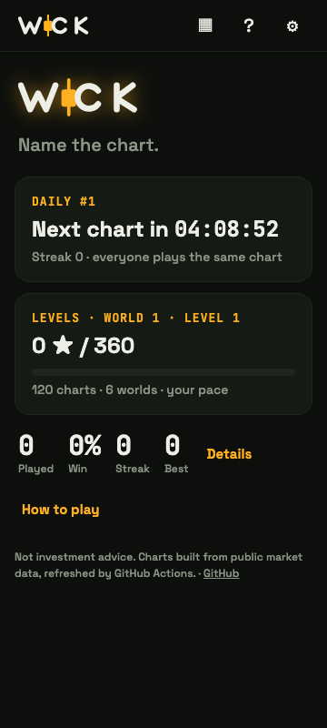
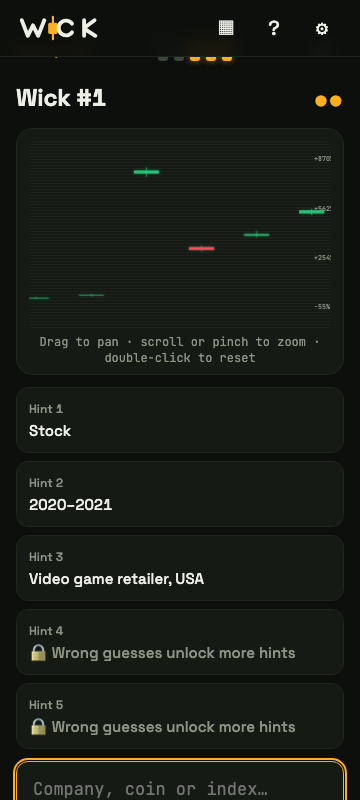
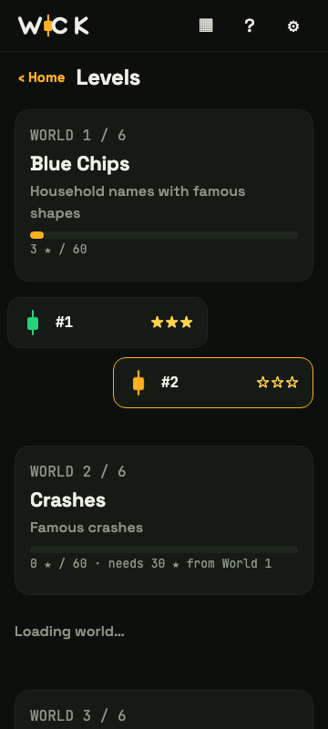

# WICK — Name the chart

A free daily game and a 120-level journey through famous market moments. One chart, no labels, 5 guesses to name the asset.

Live URL: https://ap0l1on.github.io/Wick/

## Two modes

- **Daily:** one chart per day, the same for everyone. Fresh at 00:00 UTC, with streaks and a Wordle-style share grid.
- **Levels:** 120 charts in 6 worlds at your own pace — Blue Chips, Crashes, Moonshots, Crypto, World Markets, Legends. Solve fast for 3 ★, earn 30 ★ per world to unlock the next. Progress lives on your device; no accounts.

  

More screenshots (360 / 768 / 1280 px, all screens) live in [`screenshots/`](screenshots/).

## How the charts are built (GitHub only)

Real data only. `scripts/build-puzzles.ts` runs **only in GitHub Actions**, fetches daily closes with `yahoo-finance2` (no key), verifies every `expect`, and writes:

- `public/puzzles.json` — the 100 daily charts,
- `public/levels/w1.json` … `w6.json` — 20 levels per world, plus `index.json`,
- `data/build-report.md` — the verification report a human reads before launch.

Level content comes from `data/levels.catalog.json` (120 hand-picked windows) and `data/assets.json` (sector, country, market-cap metadata for feedback chips). The site stores only dates + an index (first = 100), never real prices.

**Spoiler rule:** the build asserts that no level chart is scheduled as a daily in the next 60 days — CI fails otherwise.

## Develop

- Node 22 LTS, Vite, TypeScript strict, Preact.
- `npm install`, `npm run dev`, `npm test`, `npm run build`.

## Analytics

Cookieless visitor counts by Cloudflare Web Analytics.

## Disclaimer

A game about market history. Not investment advice.
